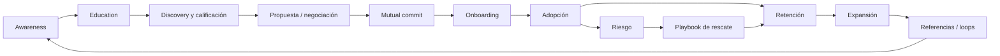
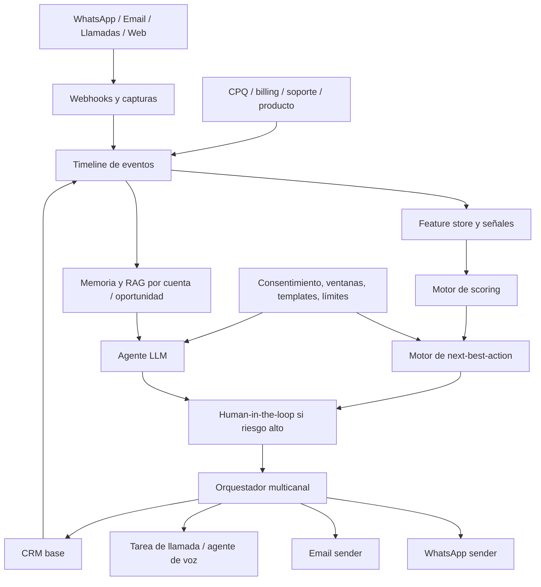

# Seguimiento de clientes con IA en CRM para B2B y pymes de Latinoamérica

## Resumen ejecutivo

Este informe implementa el brief adjunto y lo traduce a una arquitectura, una capa de decisión y un set de playbooks listos para ejecutar en equipos de CRM/RevOps/CS/SDR con fuerte dependencia de WhatsApp. El punto de diseño más importante es este: no conviene pensar el “follow-up” como una secuencia de mensajes, sino como un **sistema de decisión** que combina metodología comercial, señales de comportamiento, scoring, memoria de contexto y restricciones del canal. En la práctica, eso significa unir el lado izquierdo del funnel —descubrimiento, calificación, propuesta— con el lado derecho —onboarding, adopción, retención y expansión— siguiendo el enfoque Bowtie y Revenue Architecture, y operacionalizarlo con playbooks y agentes que trabajen sobre datos estructurados del CRM y datos no estructurados de conversaciones. fileciteturn0file0 citeturn17view0turn11search2turn11search5turn10search3

La recomendación central para pymes y equipos mid-market en LATAM es **empezar con un modelo híbrido**: reglas + scoring explicable + LLM asistido + automatización controlada por eventos. La razón es simple. En SMBs y CRMs propios rara vez existe, desde el día uno, el volumen de labels necesario para que un modelo predictivo gane a un sistema híbrido bien diseñado. HubSpot pide una muestra mínima de 50 contactos con 25 convertidos y 25 no convertidos para construir AI lead scoring, mientras que Salesforce exige mucho más volumen para Einstein Lead Scoring: al menos 1.000 leads creados en 200 días y al menos 120 conversiones. Los motores más avanzados de next-best-action con bandits o RL existen y funcionan, pero aparecen sobre todo en entornos con inventario estable de acciones, logging de rewards y bucles de feedback maduros, como Pega, Zillow o implementaciones productivas de Microsoft. citeturn37search2turn30search17turn38search2turn38search3turn38search0

Para el stack, la mejor forma de pensar no es “qué CRM compro”, sino **qué capa cumple cada función**. Salesforce, HubSpot, Zoho, Pipedrive, Freshsales y Close resuelven el sistema transaccional base; Salesloft, Outreach, Apollo y Gong resuelven execution, priorización y conversación; Intercom, Kommo, HighLevel y Manychat potencian el canal conversacional; Clay y Attio aportan enriquecimiento, research y automatización GTM; y la nueva ola de AI SDRs —11x, Artisan, Regie.ai, AiSDR, Spara, Unify— cubre prospecting autónomo o semiautónomo, normalmente como capa adicional y no como “source of truth” del pipeline. Drift no debería ser elección greenfield: hoy es una solución legacy dentro del portfolio de Salesloft y está siendo sunseteada. citeturn30search4turn26search2turn27search0turn28search3turn29search1turn29search0turn3search0turn2search7turn29search3turn36search13turn3search14turn20search1turn4search19turn31search2turn31search0turn31search1turn8search1turn9search0turn8search2turn8search3turn9search1turn9search2turn33search3turn7search4

En términos operativos, las palancas de mayor retorno son muy consistentes entre las fuentes. La velocidad importa: el estudio MIT/InsideSales halló que responder un lead web en 5 minutos versus 30 minutos multiplica por 21 la probabilidad de cualificarlo, y la probabilidad de contacto cae 100 veces; Gong, con benchmarks de Engage basados en datos de 2024, muestra que los mejores reps duplican o más los ratios base de reply y connect, que los emails manuales superan a los automatizados, que iniciar con llamada fría puede doblar la tasa de respuesta posterior por email, que dejar voicemail también la dobla, y que las mañanas de martes y miércoles concentran los mejores connect rates. Por eso, el sistema recomendado para LATAM debe ser **event-driven, no calendar-driven**. citeturn24view0turn25view0turn35view0

La implicación práctica es contundente. Si solo se puede desplegar una versión inicial en 30 a 45 días, debería incluir cinco cosas: una línea de tiempo unificada de eventos; un score híbrido de prioridad; un motor de next-best-action explicable; cadencias multicanal con WhatsApp sujeto a reglas de ventana y templates; y prompts estructurados en JSON para clasificación, resumen, drafting y sugerencias de siguiente paso. Esa combinación genera valor antes de llegar a modelos más caros o más opacos. citeturn32search2turn32search1turn32search3turn14search0turn14search3turn36search1turn26search9turn28search6

## Marco de seguimiento recomendado

La mejor manera de evitar que el follow-up se convierta en spam automatizado es separar claramente **qué metodología comercial guía la conversación** y **qué sistema operativo guía la ejecución**. La metodología responde “qué debo descubrir o validar”; el sistema operativo responde “qué acción, por qué canal, con qué mensaje y en qué momento”. El error más habitual en CRMs es escoger solo un framework de discovery y tratar de usarlo para todo el ciclo. El modelo Bowtie y Revenue Architecture corrigen ese problema porque amplían el embudo clásico hacia onboarding, adopción, retención y expansión, y añaden closed loops que conectan impacto, referencias, expansión y adquisición. Winning by Design lo plantea de forma explícita: el funnel tradicional termina donde empieza el ingreso recurrente, y el lado derecho del Bowtie es donde se juega la mayor parte del valor largo plazo. citeturn17view0turn18view1turn18view2turn18view3

En un sistema con IA, por tanto, la combinación más robusta no es “SPIN o MEDDIC”, sino una **arquitectura de playbooks**. SPIN sirve para discovery consultivo y para profundizar dolor; BANT sirve para triage rápido en inbound o low-ticket; MEDDIC/MEDDPICC sirve para oportunidades complejas donde forecast y governance de deal importan; Challenger sirve para reframing e insight-led selling; y Bowtie/Revenue Architecture sirve para gobernar el ciclo completo, incluyendo activación, valor, renovación y expansión. Gong ya trata este enfoque como operable en producto: sus playbooks preconstruidos incluyen MEDDICC, BANT, SPIN, Challenger, entre otros. citeturn42search0turn11search18turn42search2turn42search13turn11search0turn10search3turn17view0turn11search2

El diagrama siguiente resume el modelo operativo recomendado para follow-up con IA: calificación profunda al inicio, compromiso mutuo en la mitad y postventa gobernada por señales de impacto y riesgo en la derecha del Bowtie. Está inspirado en Bowtie/Revenue Architecture y adaptado a una operación B2B/SMB con WhatsApp como canal prioritario. citeturn17view0turn11search5



| Marco | Dónde aporta más | Qué debe quedar registrado en CRM | Cómo lo convertimos en follow-up accionable |
|---|---|---|---|
| SPIN | Discovery consultivo, demos y primeras llamadas | preguntas de situación, problemas, implicaciones, need-payoff | usarlo para prompts de calificación, resúmenes de llamada y drafting de recap |
| BANT | Triage rápido de inbound, SMB y low-ticket | presupuesto, autoridad, necesidad, timing | usarlo para enrutar, puntuar y decidir si conviene WhatsApp, email o llamada |
| MEDDIC/MEDDPICC | Oportunidades mid-market/enterprise y forecast | métricas, economic buyer, criterios/proceso de decisión, champion, competencia | usarlo para deal reviews, alertas de riesgo y “campos obligatorios” antes de avanzar etapa |
| Challenger | Ofertas nuevas, categorías no maduras, deals donde hay que reeducar al buyer | hipótesis de insight, “commercial teaching”, objeciones clave | usarlo para mensajes que reencuadran prioridad y costo de no actuar |
| Bowtie | Ciclo completo de revenue | activación, adopción, time-to-value, renovación, expansión | usarlo para postventa, health scoring y rescates de churn |
| Playbooks | Gobernanza operativa | triggers, SLA, owners, tareas, plantillas, criterios de salida | usarlo para automatizar y auditar ejecución humana y de agentes |

La tabla sintetiza definiciones y usos apoyados en HubSpot y Pipedrive para SPIN, Mailchimp/OBS para BANT, MEDDICC/Salesforce para MEDDIC, Salesforce/Challenger para Challenger, Winning by Design para Bowtie/Revenue Architecture, y Gong para playbooks productizados. citeturn42search0turn42search7turn11search18turn11search14turn42search2turn42search13turn11search0turn17view0turn11search2turn10search3

La recomendación práctica es usar un **playbook compuesto por segmento**. Para SMB inbound: BANT + SPIN + SLA de respuesta. Para mid-market: SPIN + Challenger + score de oportunidad. Para enterprise: MEDDIC/MEDDPICC + Challenger + deal intelligence. Para clientes activos: Bowtie + health/churn + workflows de value realization. Así, el LLM no “inventa” su forma de vender; sigue una metodología explícita y medible. citeturn42search0turn42search2turn11search0turn17view0turn10search3

## Modelos, scoring y señales

Los sistemas de follow-up con IA suelen fallar por dos razones opuestas: o son demasiado manuales y no priorizan nada, o son demasiado “inteligentes” y no pueden explicarle al equipo por qué recomiendan una acción. Para evitar ambos extremos conviene separar la valoración en cuatro niveles: **fit**, **engagement**, **intent**, y **riesgo/health**. Ese enfoque está alineado con cómo varios CRMs comerciales ya presentan el problema: HubSpot separa fit y engagement scores; Salesforce asigna scores predictivos a leads y oportunidades; Zoho combina scoring rules, field prediction y Next Best Experience; Pipedrive introduce Scores, Pulse y deal rotting; Freshsales usa Freddy para señales de riesgo de deal y next best action; y Gong convierte conversaciones en datos estructurados y señales semánticas. citeturn37search2turn37search10turn30search0turn30search1turn27search1turn27search3turn27search13turn28search0turn28search1turn28search4turn29search1turn29search15turn36search1turn39search0

Las señales más útiles para follow-up no son solo demográficas. Para acquisition, los mejores predictores tienden a mezclar ICP fit con evidencia reciente de comportamiento: visitas a pricing o producto, respuestas a email, cambios de empleo o de empresa, historial de engagement, apertura y clic, llamadas conectadas, tiempo desde último evento, y señales de warm intent desde first-party data. Salesloft define buyer signals precisamente en esa dirección, incluyendo interacciones web y cambios de empleo/empresa; Gong detecta conceptos y sentimiento más allá de keywords; Gainsight considera la salida del champion un red flag clásico; y HubSpot Conversation Intelligence permite capturar objeciones, patrones de desempeño y voz del cliente directamente en el CRM. citeturn37search0turn37search8turn39search0turn11search12turn39search2

Para SMB y CRMs propios, el orden correcto de sofisticación es: **reglas explicables → scoring híbrido → modelos predictivos → uplift → bandits/NBA adaptativo**. No conviene empezar por RL. La evidencia apunta a que los bandits son poderosos cuando existe decisión repetida con feedback parcial y contexto estable; Microsoft los ha desplegado en un bot de soporte con mejoras relativas de más de 12% en problem resolution y reducción de más de 4% en escalaciones; Pega usa contextual bandits en su framework de Next-Best-Action; Zillow describe la misma lógica para personalización de NBA. Pero todo eso exige un pipeline limpio de acciones, contexto y rewards. En la mayoría de pymes, ese logging aún no existe. citeturn38search0turn38search8turn15search1turn38search2turn38search3

RFM y CLTV siguen siendo útiles, siempre que se adapten al contexto B2B. RFM no tiene por qué limitarse a ecommerce; puede reinterpretarse como **recency de interacción significativa**, **frequency de reuniones/respuestas/uso**, y **monetary value** como ARR, ticket o potencial de expansión. Por su lado, CLTV y churn ganan mucho cuando se llevan a supervivencia, porque la pregunta no es solo “quién se irá”, sino “cuándo y con cuánto valor esperado”. La literatura reciente sobre CLV en SaaS y survival analysis apunta precisamente a esa dirección, y el artículo de Industrial Marketing Management sobre uplift en churn B2B recuerda algo clave: no basta predecir quién tiene riesgo, hay que estimar **qué tratamiento cambia el resultado**. citeturn16search17turn16search9turn16search0turn16search18turn15search0turn15search8

| Modelo | Úsalo para | Cuándo es suficiente | Cuándo subir de nivel |
|---|---|---|---|
| Reglas de fit + engagement | priorizar leads y tareas | cuando hay poco dato histórico pero sí criterios comerciales claros | cuando ya tengas conversiones suficientes y feedback estable |
| Scoring predictivo de lead | predecir conversión de lead | cuando ya hay labels limpios y volumen razonable | cuando necesites explicar menos y acertar más |
| Scoring de oportunidad | estimar win likelihood y detectar deals en riesgo | cuando el pipeline tiene etapas disciplinadas | cuando quieras automatizar rescue plays y forecast |
| Engagement / momentum score | decidir quién merece follow-up hoy | desde muy temprano si capturas eventos | cuando quieras sumar intent data y señales conversacionales |
| RFM adaptado a B2B | reactivación, expansión y priorización de cartera | sirve muy bien aun con dato simple | cuando quieras pasar a CLTV o churn prescriptivo |
| CLTV / supervivencia | asignar esfuerzo por valor esperado | cuando ya entiendas retención por segmento | cuando quieras presupuestar CS/retention científicamente |
| Churn uplift | elegir tratamiento de rescate | cuando ya registras intervención y outcome | cuando quieras optimizar costo de retención |
| Intent detection + conversation intelligence | entender tema, objeción, sentimiento e intención real | muy útil desde el inicio con transcripciones y mensajes | cuando quieras poblar CRM automáticamente |
| NBA con reglas y bandits | decidir canal, momento, contenido y owner | reglas primero; bandits después | cuando el reward logging sea maduro |

La tabla resume una progresión recomendada sustentada por documentación de scoring en HubSpot, Salesforce, Zoho, Pipedrive y Freshsales, además de literatura académica sobre RAG, CLTV, churn uplift y contextual bandits. citeturn37search2turn30search0turn30search1turn27search1turn27search3turn28search0turn29search15turn14search0turn16search0turn15search0turn38search0turn38search3

Un punto especialmente importante para pymes: **si no cumples umbral de datos, no fuerces predictive scoring**. HubSpot puede entrenar con un mínimo relativamente accesible; Salesforce Einstein pide bastante más volumen. Esa diferencia hace que muchas pymes LATAM y CRMs privados estén mejor servidos por un engine híbrido explicable durante varios meses. Esa no es una renuncia a la IA; es una secuencia de maduración más rentable. citeturn37search2turn30search17

El siguiente pseudocódigo muestra una versión inicial, explicable y productizable de un motor de prioridad. No intenta “aprenderlo todo”; intenta tomar mejores decisiones con los datos que una pyme realmente tiene. Su valor está en la trazabilidad y en que acepta feedback humano. Esa filosofía está alineada con cómo Salesforce, HubSpot, Zoho, Pipedrive, Freshsales y Gong exponen o explican scoring, insight factors y next steps. citeturn30search6turn20search9turn27search9turn28search0turn29search15turn36search1

```python
# Pseudocódigo de scoring híbrido para prioridad de follow-up

def score_record(record, now):
    fit = 0
    fit += 20 if record.company_size in ICP_COMPANY_SIZES else 0
    fit += 20 if record.industry in ICP_INDUSTRIES else 0
    fit += 20 if record.persona in ICP_PERSONAS else 0
    fit += 10 if record.country in TARGET_COUNTRIES else 0
    fit += 10 if record.use_case in ICP_USE_CASES else 0

    engagement = 0
    engagement += 15 if record.last_reply_days <= 2 else 0
    engagement += 10 if record.last_meeting_days <= 7 else 0
    engagement += 8  if record.pricing_page_visit_days <= 7 else 0
    engagement += 8  if record.quote_viewed else 0
    engagement += 5  if record.voicemail_left else 0
    engagement += 6  if record.whatsapp_inbound_last_24h else 0

    intent = 0
    intent += 15 if record.detected_intent in ["comprar", "evaluar", "cotizar"] else 0
    intent += 8  if record.job_change_signal else 0
    intent += 8  if record.product_usage_spike else 0
    intent += 5  if record.competitor_mentioned else 0

    risk = 0
    risk += 12 if record.no_response_streak >= 4 else 0
    risk += 10 if record.deal_rotting else 0
    risk += 8  if record.sentiment == "negativo" else 0
    risk += 8  if record.champion_left else 0

    freshness_decay = days_decay(record.last_meaningful_event_days)

    raw_score = (
        0.35 * normalize(fit) +
        0.30 * normalize(engagement) +
        0.25 * normalize(intent) -
        0.20 * normalize(risk)
    ) * freshness_decay

    if record.stage in ["proposal", "negotiation"] and record.quote_viewed:
        raw_score += 0.08

    return clamp(raw_score, 0, 1)
```

En la práctica, este score debería convivir con dos salidas adicionales: **explicación** y **siguiente acción**. Sin explicación, el equipo no confiará. Sin siguiente acción, el score se queda en dashboard decorativo. citeturn30search6turn27search13turn29search15turn36search1

## Plataformas y stack de mercado

La elección de plataforma debe hacerse por **capas de capacidad**. Lo que suele salir mal en LATAM no es “escoger el CRM equivocado”, sino intentar que una sola herramienta haga sistema de registro, inteligencia conversacional, cadenciamiento, data enrichment, WhatsApp, CPQ, soporte y agentes autónomos a la vez. El diseño más estable usa un CRM base, una capa de señales/conversación, una capa de orquestación multicanal, y, si hace falta, una capa de agentes de prospecting. citeturn30search13turn26search2turn31search0turn36search13turn32search18

| Plataforma | Rol recomendado en el stack | Fuerte en follow-up | Mejor encaje |
|---|---|---|---|
| Salesforce | CRM base enterprise | Einstein lead/opportunity scoring, Next Best Action, Agentforce SDR | enterprise o mid-market con procesos complejos |
| HubSpot | CRM base SMB-mid | fit/engagement scoring, sequences, workflows, WhatsApp nativo, Breeze agents | pymes y scale-ups que quieren rapidez de implementación |
| Zoho CRM | CRM base SMB-mid | scoring rules, field prediction, best time to contact, Next Best Experience | pymes con fuerte foco en costo/beneficio |
| Pipedrive | CRM base SMB | Scores, Pulse, automations, deal rotting, Sales Assistant | equipos comerciales pequeños que necesitan disciplina operativa |
| Freshsales | CRM base SMB-mid | Freddy insights, next best action, scoring y win-risk | pymes que priorizan rapidez y simplicidad |
| Close | CRM + execution | calling/email/SMS nativos, workflows, Chloe como AI sales teammate | SDR teams y negocios con mucha llamada |
| Salesloft | capa de revenue orchestration | signal-to-action, plays, meeting/email follow-up, buyer signals | orgs con sales execution formal |
| Outreach | capa de sales execution | plays, triggers y procesos basados en buyer signals y predicciones | equipos outbound y RevOps maduros |
| Apollo | data + sequences + execution | multichannel sequences, rulesets y prospect data | outbound táctico con presupuesto contenido |
| Gong | conversation intelligence + CRM enrichment | smart trackers, AI data extraction, playbooks, deal risk | equipos que ya venden por llamada/demo y quieren verdad de pipeline |
| Intercom | canal conversacional + soporte/ventas | Fin en WhatsApp/email/SMS, workflows, outbound follow-up | motions híbridos sales + support |
| Kommo | CRM conversacional | inbox unificada para WhatsApp/redes, automatización y bookings | ventas por mensajería |
| HighLevel | CRM + agencia/local business motion | AI Employee, Voice AI, Conversation AI, workflows | agencias y SMBs operando múltiples negocios |
| Manychat | automatización de mensajería | flows automáticos en WhatsApp/Instagram/TikTok/Messenger | adquisición conversacional y nurture transaccional |
| Attio | AI CRM flexible | workflows, sequences y modelo de datos moderno | equipos RevOps que valoran flexibilidad de dato |
| Clay | research y enrichment | AI research agents, data orchestration y personalization at scale | prospección, reactivación y enrichment |
| 11x / Artisan / Regie.ai / AiSDR / Spara / Unify | capa de AI prospecting | sourcing, personalization, sequences, inbound/outbound autónomo o semi-autónomo | usar como capa adicional, no como CRM fuente de verdad |

La tabla resume capacidades documentadas por Salesforce, HubSpot, Zoho, Pipedrive, Freshsales, Close, Salesloft, Outreach, Apollo, Gong, Intercom, Kommo, HighLevel, Manychat, Attio, Clay y startups AI SDR. citeturn30search0turn30search1turn30search2turn30search4turn26search3turn26search8turn26search9turn26search10turn27search1turn27search3turn27search13turn27search16turn28search0turn28search1turn28search4turn28search6turn28search21turn29search1turn29search15turn29search0turn29search10turn3search0turn3search15turn20search20turn2search7turn29search3turn29search6turn36search1turn39search0turn3search14turn20search1turn20search11turn4search19turn31search2turn31search1turn31search4turn31search0turn31search3turn9search0turn8search1turn8search2turn8search3turn9search1turn9search2

Para una pyme latina típica, la shortlist inicial suele quedar así. Si quieres **rapidez y menor complejidad**, HubSpot, Zoho, Pipedrive, Freshsales y Close son apuestas muy razonables. Si WhatsApp es realmente el centro del motion, Kommo, Intercom, HighLevel o Manychat pueden ser más decisivos que el CRM base. Si ya existe fuerza de ventas por llamada, Gong se vuelve una capa de ROI muy visible, porque convierte conversaciones en estructura y señales. Si la prioridad es prospección inteligente y enrichment, Clay y los AI SDRs son potentes, pero conviene conectarlos a un CRM que siga siendo el repositorio maestro. citeturn26search3turn27search13turn28search4turn29search1turn29search0turn3search14turn20search1turn4search19turn31search2turn36search1turn31search0turn9search0turn8search1turn8search2turn8search3

Hay dos riesgos que merecen tratamiento explícito. El primero es **seguridad e integraciones**: el incidente de Drift/Salesloft llevó a FINRA a advertir sobre el riesgo de tokens OAuth comprometidos y a recomendar revocaciones/rotaciones; en cualquier diseño donde chatbots o agents toquen CRM, correo o data warehouse, la gestión de tokens, scopes y webhook signing no es opcional. El segundo riesgo es **obsolescencia de capa**: Drift es oficialmente legacy y Clari + Salesloft anunció su sunset progresivo a favor de nuevas capacidades. No lo elijas para greenfield. citeturn7search6turn7search4turn33search3

## Arquitectura técnica para WhatsApp y CRM

La arquitectura recomendada es **event-driven, no request-driven**. El LLM no debería leer la base transaccional “en vivo” cada vez que tenga que responder. Lo correcto es construir una línea de tiempo de eventos por lead, contacto, cuenta y oportunidad; enriquecerla con contexto de conversación; indexarla para retrieval; y dejar que el agente consulte esa memoria antes de decidir o redactar. Esto está en línea con la lógica de RAG —combinar memoria paramétrica y no paramétrica para respuestas más específicas y factualizadas— y con cómo Meta, HubSpot, Pipedrive, Zoho y Gong exponen webhooks, workflows, CRM sync y extracción estructurada. citeturn14search0turn14search3turn32search3turn32search11turn26search9turn28search6turn27search23turn36search1turn36search19

El diagrama siguiente muestra una arquitectura de referencia viable tanto para un stack SaaS como para un CRM propio o “ariCRM-like”. En este último caso, la recomendación es inferencial porque la huella pública de AriCRM parece limitada a una instancia de login/versionado sin documentación pública visible; por eso conviene asumir integración por API mínima y webhooks, no acoplamiento profundo ni acceso directo del LLM a tablas internas. citeturn41search1turn14search0turn32search3



### Patrones de integración que sí funcionan

**Timeline de eventos canónica.** Cada evento importante debe quedar normalizado: creación del lead, primer contacto, reply, apertura, visita pricing, llamada conectada, cotización enviada, cotización vista, inbound WhatsApp, demo realizada, no-show, ticket crítico, champion change, renovación próxima, upsell. Sin esta línea de tiempo, el LLM redactará bien, pero decidirá mal. El propio Bowtie de Winning by Design insiste en métricas de volumen, conversión y tiempo sobre el ciclo completo; Meta expone webhooks para mensajes entrantes, estados y errores; y Gong permite escribir campos del CRM a partir de conversaciones recientes. citeturn18view3turn32search3turn32search11turn36search1turn36search19

**Memoria por capas.** Conviene separar memoria de perfil, memoria de oportunidad, memoria conversacional y memoria de políticas. Perfil: ICP, país, industria, ticket. Oportunidad: etapa, monto, champion, próximos pasos. Conversacional: resúmenes de llamadas y mensajes con citas del CRM o transcript. Políticas: consentimiento, canal permitido, ventana WhatsApp, templates aprobados, idioma. RAG no reemplaza el CRM; lo vuelve consultable y usable por agentes. citeturn14search0turn14search3turn32search2turn32search1

**Orquestación multicanal con restricciones del canal.** WhatsApp permite mensajes free-form dentro de la customer service window de 24 horas; fuera de esa ventana deben usarse templates preaprobados. Meta también ofrece interactive messages, Flows y webhooks, lo que vuelve a WhatsApp apto no solo para “mensajería”, sino para captura estructurada de datos, microformularios y nudges transaccionales. Para LATAM esto es crucial: si el canal principal es WhatsApp, el sistema debe saber cuándo responder libremente, cuándo disparar template utility o marketing, y cuándo mover la conversación a email o llamada. citeturn32search2turn32search1turn19search3turn32search0turn32search18turn32search3turn32search6

**Human-in-the-loop por riesgo, no por capricho.** No todo mensaje merece aprobación humana. Sí la merecen: objeciones legales o de pricing fuera de policy, clientes con sentimiento negativo, cuentas estratégicas, respuestas a objeciones sensibles, y reactivaciones masivas con alto riesgo reputacional. En el resto, el sistema puede auto-redactar y hasta auto-enviar si existen guardrails y opt-ins claros. HubSpot, Gong, Zoho, Pipedrive y Freshsales ya operan alrededor de esta lógica: sugerir, resumir, actualizar o recomendar sin obligar a que todo pase por el humano todo el tiempo. citeturn26search10turn36search1turn27search13turn28search21turn29search15

El motor de next-best-action no debería devolver solo una acción; debería devolver una acción, una explicación, un canal, un horizonte de tiempo y una condición de salida. Abajo va una versión productizable. Conceptualmente se apoya en scoring explicable y, cuando el logging madure, puede incorporar bandits contextuales como hacen Pega, Zillow o Microsoft. citeturn38search2turn38search3turn38search0

```python
# Pseudocódigo de next-best-action

def next_best_action(record, policy, score):
    actions = [
        "send_whatsapp_freeform",
        "send_whatsapp_template",
        "send_email_manual_draft",
        "create_call_task",
        "book_demo_nudge",
        "handoff_to_human",
        "wait_for_signal",
        "close_lost_candidate"
    ]

    feasible = [a for a in actions if is_allowed(a, record, policy)]

    ranked = []
    for action in feasible:
        p_reply = predict_reply_prob(record, action)
        p_meeting = predict_meeting_prob(record, action)
        p_progress = predict_stage_progress(record, action)

        value = (
            0.4 * p_reply +
            0.3 * p_meeting +
            0.3 * p_progress
        )

        cost = action_cost(action)
        risk = reputational_risk(record, action, policy)
        urgency = urgency_multiplier(record)

        expected_utility = value * urgency - cost - risk

        ranked.append({
            "action": action,
            "utility": expected_utility,
            "why": explain(action, record, score),
            "channel": recommended_channel(action),
            "send_in": recommended_delay(record, action),
            "stop_if": exit_condition(record, action)
        })

    ranked.sort(key=lambda x: x["utility"], reverse=True)
    return ranked[0]
```

La regla de madurez es sencilla. **Fase inicial**: NBA determinístico y explicable. **Fase intermedia**: score predictivo y recommendation model. **Fase avanzada**: contextual bandit para optimizar “qué acción funciona mejor con qué contexto”. No hace falta saltar al final desde el inicio. citeturn38search2turn38search3turn38search0

## Cadencias, mensajes y prompts listos para producción

La cadencia correcta no se define por “número de toques”, sino por **temperatura, etapa, señal y tolerancia del canal**. Los benchmarks más útiles aquí son tres. Primero, velocidad: el MIT/InsideSales study muestra que 5 minutos le ganan de forma aplastante a 30 minutos. Segundo, calidad: Gong muestra que emails manuales superan a automatizados en open, click y reply, así que la IA debe ayudar a personalizar, no a industrializar plantillas vacías. Tercero, mezcla de canales: Gong observa que iniciar con cold call y dejar voicemail incrementa la probabilidad de respuesta por email. HubSpot, además, deja claro que las sequences por defecto operan en business days y permiten ventanas inteligentes de envío. citeturn24view0turn25view0turn35view0turn26search0turn26search8

| Escenario | Primer SLA | Secuencia recomendada | Salida o stop condition |
|---|---|---|---|
| Inbound caliente | menos de 5 minutos | WhatsApp o llamada inmediata; email recap si no responde; segundo intento mismo día | responder, agendar, o marcar “sin contacto” con fecha de reintento |
| Post-demo sin decisión | mismo día | recap por email + WhatsApp corto; recordatorio a las 48h; llamada antes del día 5 | siguiente paso agendado o close-lost razonado |
| Post-cotización | menos de 24h desde envío o vista | WhatsApp breve + email contextual; nudge cuando la cotización se abre; llamada si hay alta intención | aclaración de objeción, negociación o cierre |
| Lead dormido 30-90 días | event-driven por nueva señal | reactivación por email o WhatsApp con nuevo insight/caso/señal; no más de 3 toques iniciales | reply o nueva fecha de nurture |
| No-show | menos de 15 minutos | WhatsApp y email de rebooking; segundo intento al día siguiente | reunión reagendada o pause |
| Renovación/riesgo | según health threshold | mensaje de valor + chequeo ejecutivo + llamada/CSM task + playbook de rescate | success plan o plan de churn controlado |

La lógica de esta tabla se apoya en MIT/InsideSales para rapidez, en Gong para mezcla de llamada/email y benchmarking de reply/connect, y en HubSpot para configuración temporal de secuencias. citeturn24view0turn25view0turn35view0turn26search0

### Ejemplos de mensajes de WhatsApp en español

Dentro de la ventana de 24 horas, estos mensajes pueden ir como free-form; fuera de esa ventana deben transformarse en templates aprobados según categoría. Si usas Flows o interactive messages, añade botones de CTA o selección guiada. citeturn32search2turn32search1turn19search3turn32search0

**Inbound caliente**
> Hola, {{nombre}}. Vi tu interés en {{producto/servicio}}. Para no hacerte perder tiempo: ¿tu prioridad hoy es {{resultado_A}} o {{resultado_B}}? Si te sirve, te propongo 2 opciones de horario para revisarlo hoy mismo.

**Post-demo**
> Hola, {{nombre}}. Gracias por la reunión de hoy. Te dejo el resumen con los 3 puntos clave: {{punto_1}}, {{punto_2}}, {{punto_3}}. Quedó pendiente validar {{decision_item}}. ¿Prefieres que avancemos por aquí o te envío recap por email?

**Post-cotización**
> Hola, {{nombre}}. Te escribo porque ya quedó enviada la propuesta. Si lo más importante para ustedes es {{prioridad_detectada}}, te puedo resumir en 2 líneas cómo lo resolvemos y qué cambiaría para su equipo. ¿Te parece si lo vemos hoy o mañana?

**Reactivación**
> Hola, {{nombre}}. Retomo esta conversación porque vi {{señal_nueva}} y me hizo pensar que quizá cambió el momento para retomar {{objetivo}}. Si ya no es prioridad, me dices y cierro seguimiento. Si sí lo es, te propongo 2 caminos concretos para avanzar.

### Prompts completos

Los prompts siguientes están diseñados para ejecución con salida estructurada. La idea no es “pedirle al modelo que improvise”, sino obligarlo a operar como una pieza de un sistema.

#### Prompt para agente SDR inbound en WhatsApp

```text
Sistema:
Eres un SDR senior para B2B/SMB en Latinoamérica. Tu trabajo es responder por WhatsApp a leads inbound con rapidez, cortesía y foco en calificación consultiva. Usas BANT para triage y SPIN para profundizar, pero nunca interrogarás al cliente como si fuera un formulario. Debes sonar humano, breve y útil.

Objetivo:
1) calificar;
2) detectar intención;
3) proponer siguiente paso;
4) actualizar CRM con estructura.

Entradas:
- idioma_preferido: {{idioma}}
- pais: {{pais}}
- nombre_contacto: {{nombre}}
- empresa: {{empresa}}
- cargo: {{cargo}}
- crm_historial: {{crm_historial_json}}
- ultimo_mensaje: {{ultimo_mensaje}}
- oferta: {{oferta}}
- icp: {{icp_json}}
- politicas_canal: {{politicas_json}}

Reglas:
- Si falta contexto, formula máximo 2 preguntas en el siguiente mensaje.
- Prioriza preguntas de problema e implicación por encima de preguntas genéricas.
- Si detectas alta intención de compra, propone reunión con dos opciones de horario.
- Si no hay fit, cierra con respeto y deja puerta abierta.
- No inventes datos ni casos.
- No uses textos largos ni múltiples párrafos extensos.
- Si el mensaje está fuera de policy del canal, devuelve solo la recomendación y no redactes respuesta final.

Salida obligatoria en JSON:
{
  "intent_detected": "comprar|explorar|soporte|precio|objecion|reactivacion|otro",
  "temperature": "alta|media|baja",
  "fit_score_reasoned": 0-100,
  "bant": {
    "budget": "alto|medio|bajo|desconocido",
    "authority": "si|parcial|no|desconocido",
    "need": "alto|medio|bajo|desconocido",
    "timeline": "inmediato|30_dias|90_dias|sin_definir"
  },
  "spin_notes": {
    "situation": "",
    "problem": "",
    "implication": "",
    "need_payoff": ""
  },
  "next_best_action": "responder_whatsapp|agendar_reunion|enviar_email|crear_tarea_llamada|descalificar",
  "reply_whatsapp": "",
  "crm_update": {
    "stage_suggested": "",
    "fields_to_update": {
      "pain_point": "",
      "use_case": "",
      "buying_timeline": "",
      "meeting_request": true
    }
  }
}
```

Este prompt funciona mejor cuando se alimenta con historial CRM y señales recientes, no solo con el último mensaje. Esa recomendación se apoya en el enfoque RAG y en la forma en que Gong y otros vendors convierten conversaciones en datos estructurados para actualizar CRM. citeturn14search0turn36search1turn39search2

#### Prompt para reactivación de leads dormidos

```text
Sistema:
Eres un SDR/AE que reactiva leads dormidos sin sonar insistente. Debes usar evidencia nueva y un tono respetuoso. Tu objetivo es recuperar conversación, no forzar una demo.

Entradas:
- nombre: {{nombre}}
- empresa: {{empresa}}
- dias_sin_respuesta: {{dias}}
- ultima_interaccion_resumen: {{ultimo_resumen}}
- nuevas_senales: {{senales_json}}
- propuesta_de_valor: {{propuesta}}
- canal: {{canal}}
- idioma: {{idioma}}

Reglas:
- Si no hay señal nueva o novedad real, no inventes urgencia.
- Debes ofrecer salida amable ("si ya no es prioridad, te dejo de molestar").
- Usa máximo 80 palabras si el canal es WhatsApp.
- Personaliza con una sola señal fuerte, no con cinco.
- No pidas reunión en el primer renglón.
- Si la señal es fuerte, sugiere 2 caminos concretos.

Salida:
{
  "reactivation_angle": "",
  "risk_of_irrelevance": "alto|medio|bajo",
  "message": "",
  "follow_up_if_no_reply_days": 3,
  "crm_note": ""
}
```

Este prompt es especialmente eficaz si se activa por señales event-driven como visita a pricing, job change o actividad del producto, que son exactamente el tipo de buyer signals que Salesloft, Clay y Unify convierten en acciones de salida. citeturn37search0turn31search0turn31search3turn9search2

#### Prompt para seguimiento post-cotización

```text
Sistema:
Eres un AE enfocado en seguimiento post-cotización. Tu objetivo no es "preguntar si vio la propuesta", sino empujar claridad de decisión. Debes conectar la propuesta con la prioridad real del cliente, detectar objeciones probables y sugerir el siguiente paso más corto.

Entradas:
- nombre: {{nombre}}
- empresa: {{empresa}}
- deal_stage_actual: {{stage}}
- monto: {{monto}}
- propuesta_resumen: {{propuesta_resumen}}
- señal_de_compromiso: {{senal}}   # quote viewed, opened, forwarded, asked pricing question, etc.
- riesgos_detectados: {{riesgos_json}}
- notas_de_descubrimiento: {{notas_discovery}}
- canal: {{canal}}

Reglas:
- No abras con "solo quería dar seguimiento".
- Si la propuesta fue vista, referencia el resultado esperado, no el documento.
- Si hay objeción de precio, vincúlala con el impacto o el costo de demora.
- Si el canal es WhatsApp, máximo 90 palabras.
- Debes devolver también una hipótesis de objeción principal.

Salida JSON:
{
  "main_objection_hypothesis": "",
  "next_best_action": "whatsapp|email|llamada|esperar",
  "message": "",
  "call_prep": {
    "opening": "",
    "question_1": "",
    "question_2": ""
  },
  "crm_update": {
    "decision_risk": "",
    "required_field_updates": []
  }
}
```

Este prompt cobra mucho valor cuando el sistema recibe señales como “quote viewed”, falta de actividad o riesgo de deal; eso coincide con Pipedrive deal rotting, Freddy deal insights y Gong deal boards/warnings. citeturn28search1turn29search15turn37search9turn37search13

#### Prompt para clasificador de intención y sentimiento

```text
Sistema:
Clasifica el mensaje del cliente para un CRM de ventas B2B. Debes priorizar precisión y salida estructurada. No redactes respuesta comercial. Solo clasifica.

Etiquetas permitidas:
- intent: comprar, cotizar, comparar, soporte, reagendar, objecion_precio, objecion_tiempo, no_interes, renovacion, expansion, otro
- sentiment: positivo, neutral, negativo, mixto
- urgency: alta, media, baja
- risk: alto, medio, bajo

Entradas:
- historial_breve: {{historial}}
- mensaje_actual: {{mensaje}}
- etapa: {{etapa}}
- cliente_activo: {{cliente_activo}}

Salida JSON:
{
  "intent": "",
  "secondary_intent": "",
  "sentiment": "",
  "urgency": "",
  "risk": "",
  "why": "",
  "suggested_owner": "sdr|ae|csm|soporte",
  "update_fields": []
}
```

Un clasificador de este tipo refleja cómo Gong plantea smart trackers para intención y sentimiento más allá de keywords, y cómo HubSpot Conversation Intelligence captura objeciones y patrones de desempeño desde la voz del cliente. citeturn39search0turn39search3turn39search2

#### Prompt para next-best-action explicable

```text
Sistema:
Eres un motor de recomendación comercial. Tu tarea es decidir la siguiente mejor acción para un registro del CRM, explicando por qué. Debes respetar políticas de canal, etapa del deal, señales recientes y carga del equipo. No redactes mensajes largos salvo que la acción elegida sea enviar mensaje.

Entradas:
- registro_crm: {{registro_json}}
- score: {{score_json}}
- senales_recientes: {{senales_json}}
- politicas_canal: {{politicas_json}}
- capacidad_equipo: {{capacidad_json}}

Acciones posibles:
- enviar_whatsapp
- enviar_template_whatsapp
- enviar_email_personalizado
- crear_tarea_llamada
- esperar_senal
- handoff_humano
- descalificar

Salida JSON:
{
  "next_best_action": "",
  "channel": "",
  "reasoning": "",
  "send_in": "",
  "message_if_applicable": "",
  "expected_outcome": "",
  "stop_condition": ""
}
```

La recomendación de devolver explicación y condición de salida está alineada con la lógica de NBA y decisioning basada en contexto en Pega y Zillow, y evita que el sistema sea una caja negra. citeturn38search2turn38search3

#### Prompt para resumen de historial CRM y conversación

```text
Sistema:
Resume el historial CRM de una cuenta u oportunidad para que un AE o CSM pueda actuar en menos de 30 segundos. Debes separar hechos, hipótesis y riesgos. No inventes nada que no esté en el contexto.

Entradas:
- timeline_eventos: {{timeline_json}}
- notas_manual: {{notas}}
- transcripciones: {{transcripciones_resumidas}}
- metadata: {{metadata_json}}

Salida Markdown:
## Estado actual
...
## Qué sabemos con evidencia
...
## Qué es inferencia y debe validarse
...
## Riesgos y bloqueadores
...
## Siguiente mejor acción
...
## Mensaje sugerido corto
...
```

Este prompt es una aplicación directa de RAG sobre timeline de eventos y documentos conversacionales, y encaja con la práctica de AI summaries y CRM field extraction de varias plataformas modernas. citeturn14search0turn36search1turn26search10turn28search21

## KPIs, benchmarks, casos y roadmap

Los KPIs correctos para follow-up con IA no son solo opens y replies. Hay que medir **rapidez**, **contactabilidad**, **progreso comercial**, **calidad de dato**, **time-to-value** y **retención/expansión**. De lo contrario, el sistema puede parecer “productivo” mientras en realidad satura canales, empeora la reputación o acelera deals malos. citeturn35view0turn17view0

| KPI | Qué mide | Referencia útil | Cómo usarlo |
|---|---|---|---|
| Speed-to-lead | tiempo desde creación del lead hasta primer intento útil | 5 min vs 30 min cambia 21x la cualificación; la primera hora destruye odds | úsalo como SLA duro para inbound caliente |
| Email reply rate | calidad de outreach | Gong baseline 1.8%; top quartile 3.9% | compara por segmento, owner y tipo de secuencia |
| Manual vs automated reply | efecto de personalización real | manual 2.1% vs automated 1.1% en baseline Gong | usa IA para draft personalizado, no solo para volumen |
| Call connect rate | contactabilidad por llamada | Gong flow 1.9% baseline / 4.8% top quartile; non-flow 2.9% / 8.9% | identifica equipos y franjas con mejor ejecución |
| Call timing | mejor hora para conectar | martes/miércoles 9:00–12:00 en Gong | úsalo para ventanas de tasking automático |
| Opportunity momentum | probabilidad de avance real | señales de rotting, quote view, recent activity, champion status | vuelve accionable el pipeline y evita deals falsos |
| Data freshness | calidad del CRM | % de oportunidades con campos críticos completos y actualizados <7 días | protege forecast y agentes |
| Time-to-value | activación y adopción | Bowtie/right side | clave para renovación y expansión |
| Churn save rate | rescates efectivos | medir tratamiento, no solo riesgo | prepara la transición a uplift modeling |

Las referencias de la tabla provienen del MIT Lead Response Management Study, de los benchmarks de Gong Engage y del marco Bowtie/Revenue Architecture. citeturn24view0turn25view0turn35view0turn17view0turn18view3

### Casos y benchmarks que sí aportan decisiones

Los casos más útiles para un practitioner son los que conectan canal, señal y resultado. En Twilio, Nova Gestoes reporta 42% de conversion rate vía WhatsApp y que 8% de las llamadas provienen desde ese canal; en el caso de LIVE, Twilio atribuye 35% de aumento en return rates y dice que 40% del revenue reciente puede trazarse a interacciones por WhatsApp en las últimas 48 horas. Son casos vendor-reported, así que conviene usarlos como inspiración, no como benchmark contractual, pero sí muestran que WhatsApp puede ser mucho más que soporte: puede ser canal comercial y de aceleración de decisión. citeturn20search10turn20search6turn20search18

En close-range sales execution, Close muestra a Chloe como agente nativo que llama, califica, agenda y actualiza CRM; el propio sitio incluye un testimonio donde un cliente afirma que sus citas semanales aumentaron alrededor de 50% desde que Chloe entró en producción. De nuevo: es evidencia del vendor, no estudio neutral. Pero sirve para una conclusión importante: **las interacciones de voz y mensajería se están moviendo desde “asistente” a “teammate” operativo**, y eso cambia cómo debes diseñar ownership, QA y auditoría. citeturn29search0turn29search10

Gong aporta benchmarks especialmente valiosos porque son operativos y no solo promocionales: baseline de open/click/reply, diferencias manual vs automated, efecto de cold call y voicemail, y mejores franjas horarias para connect. Esos benchmarks son mucho más accionables para un RevOps team que un índice genérico de “IA mejora la productividad”, porque se pueden convertir en reglas del orquestador. citeturn35view0

### Roadmap priorizado

**Quick wins en las primeras 2 semanas.** Define la taxonomía de eventos, fija un SLA de speed-to-lead, crea tres intents obligatorios en CRM —comprar, cotizar, reactivar—, instrumenta la ventana de 24 horas de WhatsApp y aprueba un set mínimo de templates utility y marketing. Sin esto, todo lo demás descansa sobre arena. citeturn24view0turn32search1turn32search2turn20search0

**En el primer mes.** Implementa la línea de tiempo unificada, el score híbrido, los prompts estructurados y seis playbooks: inbound caliente, post-demo, post-cotización, no-show, reactivación y renovación en riesgo. Conecta webhooks de WhatsApp y sincroniza outputs del agente hacia el CRM. Si ya existe conversación por llamadas, suma transcripciones y resúmenes. citeturn32search3turn36search1turn26search9turn28search6

**Entre el segundo y el tercer mes.** Añade explainability en scoring, QA humano sobre mensajes de mayor riesgo, dashboard de benchmarks tipo Gong, y reglas de elección de canal. Si el equipo ya tiene suficiente dato limpio, prueba predictive scoring en HubSpot o Salesforce; si no, endurece la disciplina de captura antes de modelar. citeturn35view0turn37search2turn30search17

**Después.** Solo cuando tengas buena trazabilidad de acciones y resultados conviene pasar a churn uplift o NBA adaptativo con bandits. Antes de eso, el mejor retorno sigue viniendo de buen dato, mejor timing, mejor prompting y mejor governance. citeturn15search0turn38search0turn38search2

### Preguntas abiertas y limitaciones

Hay tres limitaciones que conviene dejar explícitas. La primera es de datos: las referencias de MIT y Gong son muy valiosas, pero no sustituyen benchmarking propio por segmento, país, ticket y motion. La segunda es de plataforma: la huella pública de AriCRM parece limitarse a una instancia privada de login/versionado, así que las recomendaciones para “ariCRM-like CRMs” son arquitectónicas e inferenciales, no una implementación basada en documentación pública detallada. La tercera es de canal: las políticas y categorías de WhatsApp pueden cambiar, y Meta ya ha mostrado variaciones recientes en acceso y gobernanza de chatbots, por lo que cualquier diseño debe desacoplar el motor de decisión del proveedor del canal. citeturn24view0turn35view0turn41search1turn32search1turn33news43

## Cambios recientes del mercado

Hay cuatro cambios recientes que sí deben afectar tus decisiones de arquitectura. Primero, Meta ha ofrecido acceso limitado y gratuito a la API de WhatsApp para rivales de IA en Europa mientras negocia con reguladores; eso indica que la gobernanza de acceso para bots puede seguir moviéndose y que no debes diseñar una estrategia enteramente dependiente de una sola interpretación regulatoria o de distribución. Segundo, Salesforce sigue empujando Agentforce como eje de sus productos de IA y, al mismo tiempo, ha reorientado estructura y contratación hacia esos productos. Tercero, HubSpot está empujando pricing más ligado a tareas completadas en algunos Breeze agents, lo que importa si quieres comparar “costo por output” frente a “costo por resultado”. Cuarto, el mercado sigue financiando players nuevos de conversational/AI sales, como Spara, lo que confirma que la capa agente será un mercado separado del CRM base. citeturn33news43turn34news41turn34search9turn9news39

La implicación táctica es clara. No apuestes todo a una sola suite por promesa “all-in-one”. Apuesta a **una arquitectura modular con source of truth claro, un timeline común, políticas separadas del canal, y un motor de decisioning que puedas trasladar** aunque cambie el pricing del vendor, se sunsetee una capa o cambien las reglas de acceso del canal. Esa es la forma más segura de construir algo durable para pymes y B2B en LATAM. citeturn33search3turn7search4turn33news43turn30search13turn26search2

navlistCambios recientes del mercadoturn33news43,turn34news41,turn34news40,turn9news39,turn7news35